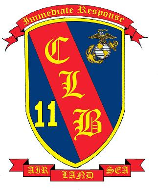

```{r setup, include=FALSE}
knitr::opts_chunk$set(echo = TRUE)
```

### [HOME](https://chandlerhaut.github.io/) | [ABOUT ME](https://chandlerhaut.github.io/about_me/) | [CV](https://chandlerhaut.github.io/about_me/CV.pdf) | [FINAL PROJECT](https://chandlerhaut.github.io/Final_Project/)

### **Current Postition: Wildlife Technician**

I am currently a wildlife technician at Camp Williams, Bluffdale, UT. My primary responsibilities are small mammals which include mist netting bats, operating pit fall traps, and conducting sherman trapping surveys. However, we are a team so assisting the avian and reptile techs occurs daily. 


### **Undergraduate**

I completed my undergraduate at Utah Valley University where I earned a degree in Integrated Studies with an emphasis in Wildlife Biology. 
```{r, echo=FALSE, out.width="200px"}
knitr:: include_graphics("Utah_Valley_University_seal.svg")
```

### **Military Service**
##### **U.S. Marine Corps, 2016-2020**

The Marines gave me many great opportunities over my tour of service. I was stationed in Iwakuni, Japan as a requisition manager with Marine Air Group 12. I was then transferred to Combat Logistics Battalion 11 in California, U.S. where I managed property and fiscal accounts. While I was with CLB-11, I was also deployed with Marine Expeditionary Unit 11 and saw countries such as Qatar, India, and the Philippines. 

```{r, echo=FALSE, out.width="200px"}
knitr:: 

```


### **Early Life**

I was born and raised in Jamestown, North Dakota where I cherished the outdoors. Through my experiences of camping, hunting, and fishing I grew a passion for the environment. This lead me to pursue the career I am today in the field of Wildlife Bilolgy. 