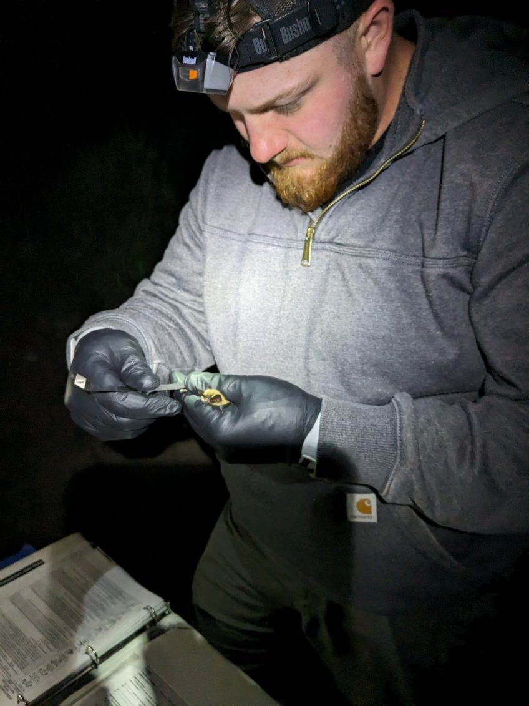
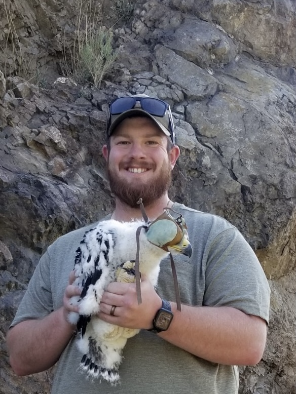
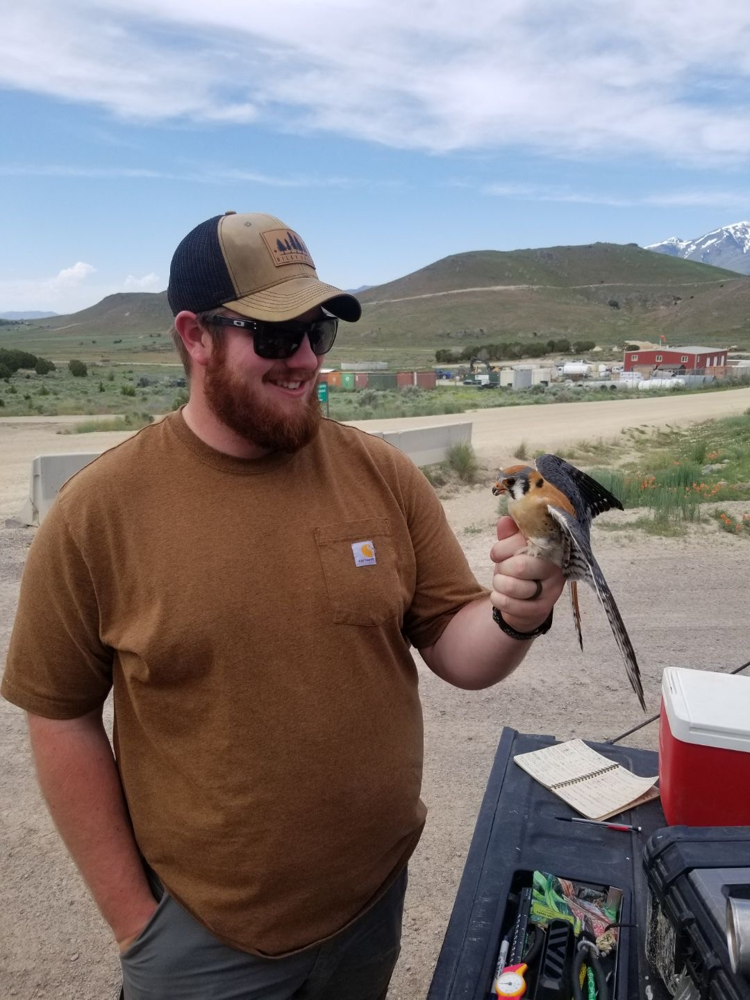
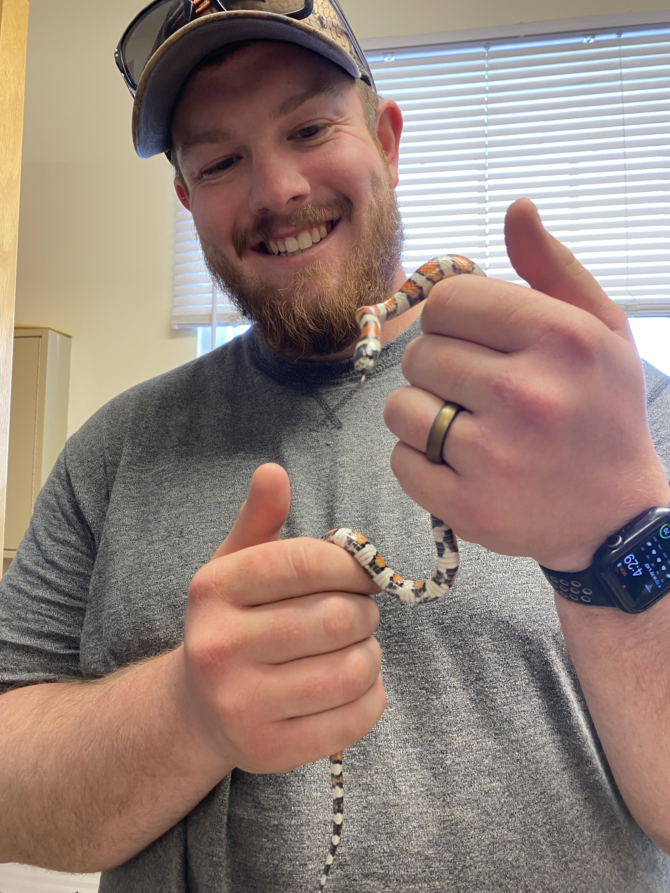

```{r setup, include=FALSE}
knitr::opts_chunk$set(echo = TRUE)
```

### [HOME](https://chandlerhaut.github.io/) | [ABOUT ME](https://chandlerhaut.github.io/about_me/) | [CV](https://chandlerhaut.github.io/about_me/CV.pdf) | [FINAL PROJECT](https://chandlerhaut.github.io/Final_Project/)

# Welcome to My Webpage

My name is Chandler Haut and I am a father, UVU graduate, and outdoor enthusiast. I am currently living in Utah and fulfilling my dream of becoming a wildlife biologist. The outdoors have been a passion of mine since I was a kid and I strive to protect them for future generations to come.  

```{r fig.show='hold', message=FALSE, out.width="50%", echo=FALSE}





```


